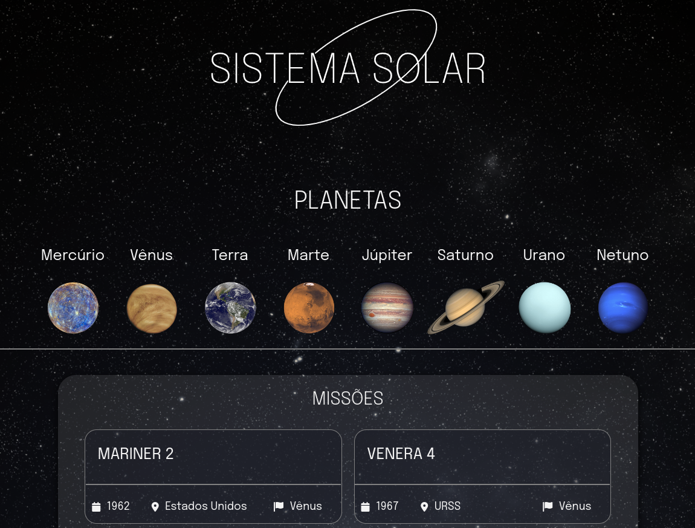

# Solar System

Este projeto visa apresentar informações sobre missões espaciais passadas e fixar os aprendizados em React adquiridos durante a introdução de Front-End do curso da Trybe.

## Tecnologias Usadas

- React.js: para construir a interface de usuário.
- CSS/Sass: para estilizar a aparência da página.
- JavaScript: para implementar a lógica da aplicação.
- HTML: para estruturar a página.

